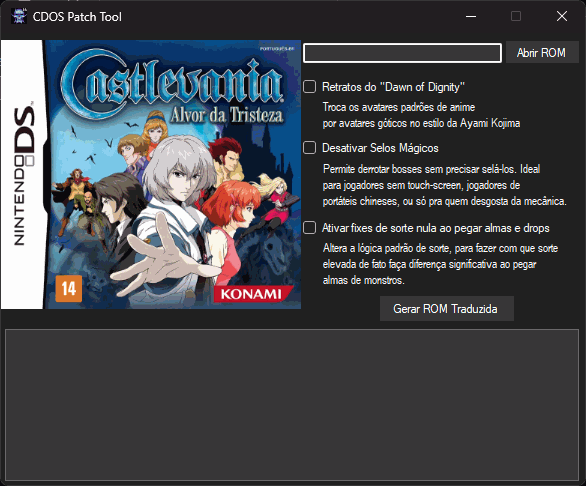

# cdos-patcher-tool

Essa é uma ferramenta patcher customizada da [tradução do Castlevania Dawn of Sorrow](https://github.com/leomontenegro6/cdos-traducao-ptbr), para português brasileiro.

A ideia foi distribuir a tradução não em uma, mas em várias versões:

- **Vanilla**: Tradução em cima do jogo original, para os que preferem o jogo como ele originalmente é.
- **Definitive Edition**: Tradução combinada com os patches de aprimoramento "Dawn of Dignity", "No Magic Seals" e "Fixed Luck".
- **Customizada**: Através da ferramenta CDOS Patcher Tool, que permite ao usuário escolher livremente se quer aplicar ou não ou seguintes patches:
  - **Dawn of Dignity**: Troca os avatares de anime genérico por avatares góticos no estilo da Ayami Kojima.
  - **No Magic Seals**: Desabilita mecânica de selos mágicos, fazendo os bosses serem selados imediatamente após derrotados.
  - **Fixed Luck**: Conserta sorte em drops de almas e equipamentos, assim diminuindo consideravelmente o *grinding* do jogo original.

O cenário das versões customizadas é um tanto mais amplo, pois as combinações de versões de patches distintos seria muito grande para tornar isso viável através de múltiplos patches, dado que isso resultaria em um número muito grande de patches a serem distribuídos.

Para endereçar esse problema, foi criada a CDOS Patcher Tool, que permite ao usuário escolher livremente quais patches adicionais à tradução deseja aplicar. A ferramenta é capaz de aplicar os patches de forma inteligente, de modo que não haja conflitos entre eles.

# Como usar

1. Baixe a última versão da ferramenta, na seção de releases deste repositório.
2. Obtenha uma cópia da rom americana de Castlevania Dawn of Sorrow (CRC32: 135737f6) e abra ela com a ferramenta, clicando em "Abrir ROM".
3. Selecione os patches adicionais que deseja aplicar, juntamente à tradução em si.
4. Clique no botão "Gerar ROM Traduzida" e aguarde a ferramenta terminar o processo.

Se tiver dado tudo certo, a rom traduzida estará na pasta "Nova_Rom", com o nome "cdos_ptbr.nds".